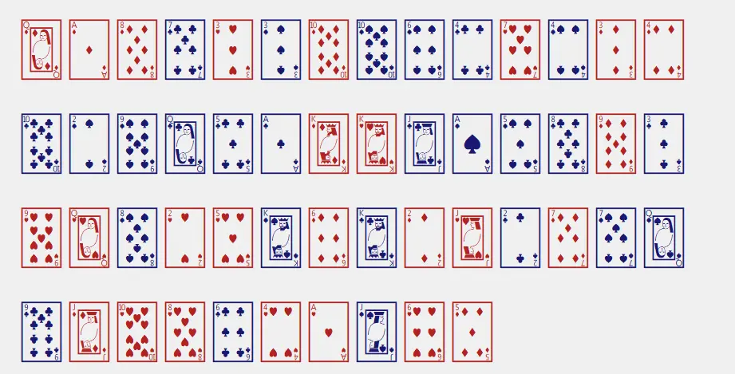

# (P)seudo (C)ard (S)huffler
For producing a pseudo-randomized list of playing cards (♠️♦️♣️♥️).



* [Overview](#overview)
* [Usage](#usage)
  * [Console](#console)
    * [Console output only](#console-output-only)
    * [Writing to a file](#writing-to-file)
  * [GUI](#gui)
    * [GUI output](#gui-output)
    * [NDO Example](#ndo)
  * [Help display](#help-display)

## Overview
Shuffling by taking a random sampling from the available cards and placing them in a position based on a random sampling from available positions in the deck.

## Usage
Outputs the list of cards to the console and optionally to a file.

### Console

#### Console output only
```
$ python card_shuffle.py
1) Two of Spade
2) King of Heart
3) Seven of Club
4) Ace of Diamond
....
52) Queen of Heart
```

#### Writing to file
```
$ python card_shuffle.py [-w,--write]
1) Three of Club
2) Ace of Spade
3) Two of Spade
4) King of Heart
....
52) Five of Heart
Decklist written to 'shuffled.decklist.txt'.
```

### GUI
Using tkinter for display and saving to an image with pillow

### GUI output
```
$ python card_shuffle.py [-g,--gui]
```

#### NDO Example
```
$ python card_shuffle.py [-d, --demo]
```

### Help display
```
$ python card_shuffle.py -h
usage: card_shuffle.py [-h] [-w] [-g] [-n]

Producing a pseudo-randomized list of playing cards.

options:
  -h, --help   show this help message and exit
  -w, --write  Flag to set for writing output to a text file
  -g, --gui    Flag to set for displaying output using tkinter
  -n, --ndo   Flag to set for displaying demo using tkinter. Other options are ignored when set.
```