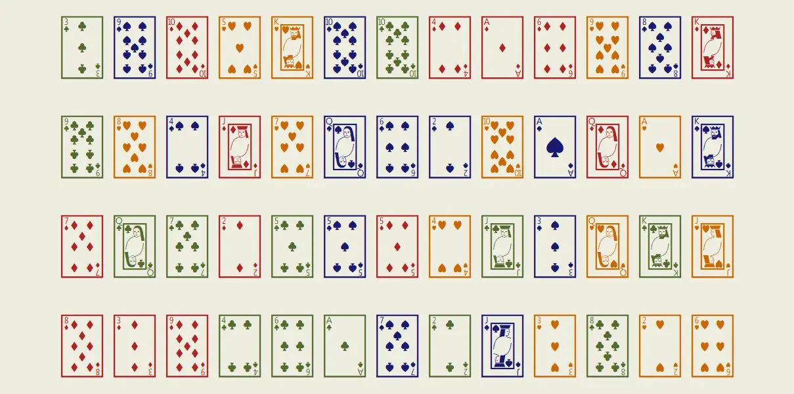

# (P)seudo (C)ard (S)huffler
For producing a pseudo-randomized list of playing cards (♠️♦️♣️♥️).



* [Overview](#overview)
* [Usage](#usage)
  * [Install dependencies](#install-dependencies)
    * [pip](#pip)
    * [pipenv](#pipenv)
  * [Console](#console)
    * [Writing to a file](#writing-to-file)
  * [GUI](#gui)
    * [NDO Example](#ndo)
  * [Help display](#help-display)

## Overview
Producing a decklist of shuffled playing cards.

## Usage

### Install dependencies
This projects needs [tkinter](https://docs.python.org/3/library/tkinter.html), [pillow](https://pillow.readthedocs.io/en/stable/) and [supports-color](https://pypi.org/project/supports-color/). Tkinter should be included with most python distributions, pillow and supports-color are available via [pypi](https://pypi.org/).
#### pip
To install dependencies globally
```
  pip install pillow supports-color
```
#### pipenv
A `Pipfile` is included for installing dependencies within a virtualenv
```
pipenv install
```
Running a script from the `Pipfile`
```
pipenv run cli
```
Running a file in the project
```
pipenv run card_shuffle.py
```
### Console
Outputs the list of cards to the terminal optionally with color and/or to a file.
```
$ python card_shuffle.py [-f, --four-color]
1) Two of Spade
2) King of Heart
3) Seven of Club
4) Ace of Diamond
....
52) Queen of Heart
```

#### Writing to file
```
$ python card_shuffle.py [-w,--write] [-f, --four-color]
1) Three of Club
2) Ace of Spade
3) Two of Spade
4) King of Heart
....
52) Five of Heart
Decklist written to 'shuffled.decklist.txt'.
```

### GUI
Using [tkinter](https://docs.python.org/3/library/tkinter.html) for display optionally with color and saving to an image with [pillow](https://pillow.readthedocs.io/en/stable/)

```
$ python card_shuffle.py [-g,--gui]
```

#### NDO Example
A demo that shows a deck in 'new deck order' ♠️:A-K, ♦️:A-K, ♣️:K-A, ♥️: K-A
```
$ python card_shuffle.py [-d, --demo]
```

### Help display
```
$ python card_shuffle.py -h
usage: card_shuffle.py [-h] [-w] [-g] [-f] [-n] [-c] [-a]

Producing a pseudo-randomized list of playing cards.

options:
  -h, --help        show this help message and exit
  -w, --write       Flag to set for writing output to a text file.
  -g, --gui         Flag to set for displaying output using tkinter.
  -f, --four-color  Flag to set for displaying each suite in a unique color.
  -n, --ndo         Flag to set for displaying demo using tkinter. Other options are ignored when set.
  -c, --cut         Flag to set for cutting the deck after the shuffle at a consecutive pair if found.
  -a, --arbitrary   Flag to set for cutting the deck after the shuffle at a random spot.
```